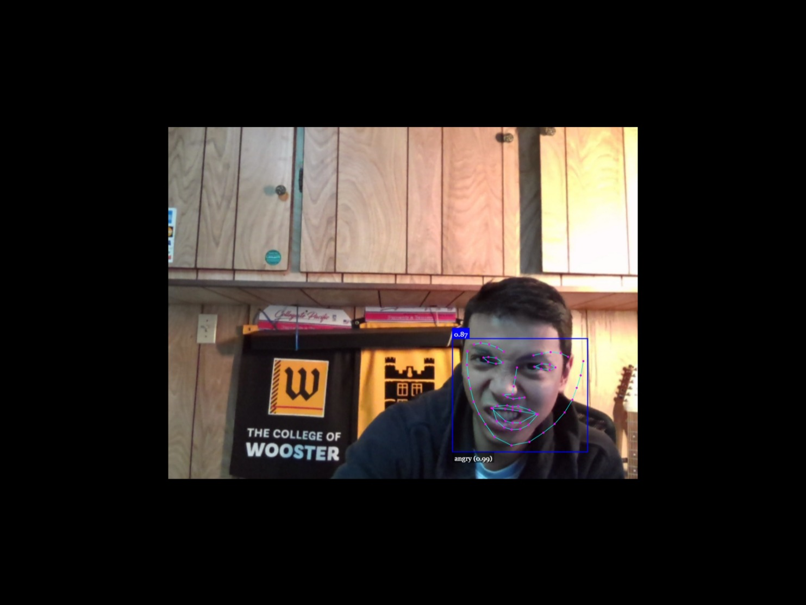

## Project Title: [ Facial-Recognition-Face-API ]

## Table of Contents
1. [Description](#description)
2. [Installation](#installation)
3. [Usage](#usage)
4. [Contributing](#contributing)
5. [Tests](#tests)
6. [License](#license)
7. [Questions](#questions)

-----

### Description 
Utilizing facial recognition AI of Face-API-Js library, this app will be able to detect human faces in real time through a webcam as well as draw facial landmarks which will be useful in determining human emotion through AI processed facial expressions.

-----

### Installation
Node.js
Face-api.js
Canvas
Tensor-flow/tfjs-node

-----

### Usage 
AI Facial Recognition with Facial Expressions, Face Landmarks

#### User Story

As a user, I want to be able to detect human faces using AI and also be able to determine emotional status and facial structure real time using a webcam.

-----

### Contributing 
YES 

-----

### Tests 
Jest

-----

### License 
MIT 

-----

### Questions 

#### GitHub Username: min-hinthar 

#### GitHub URL: https://github.com/min-hinthar

#### GitHub Repo: https://github.com/min-hinthar/facial-recognition-face-api

#### Email: min@mandalaymorningstar.com

-----
